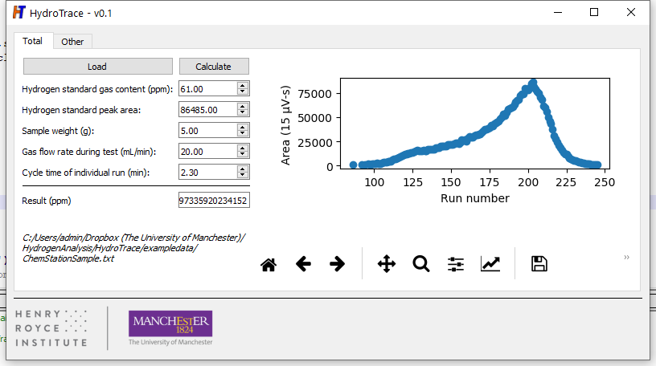

 
# Introduction

In order to address several shortcomings with ensuring similitude in examining the output from commercial hydrogen analysers, a modest suite of tools has been developed to perform basic analysis. This consists of several high-level functions that can be accessed directly from interactive Python, as well as a Graphical User Interface to access them.

  
* Overview of the HydroTrace GUI*
