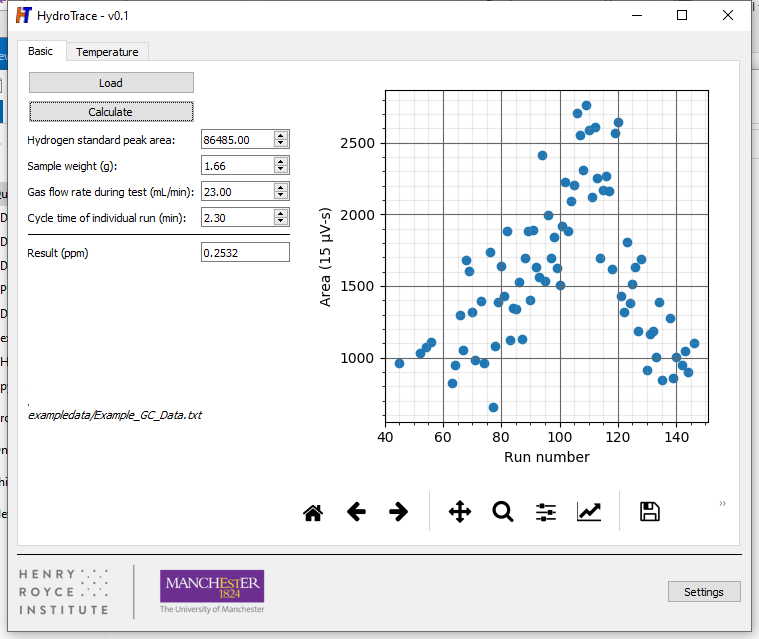
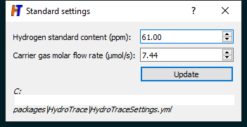
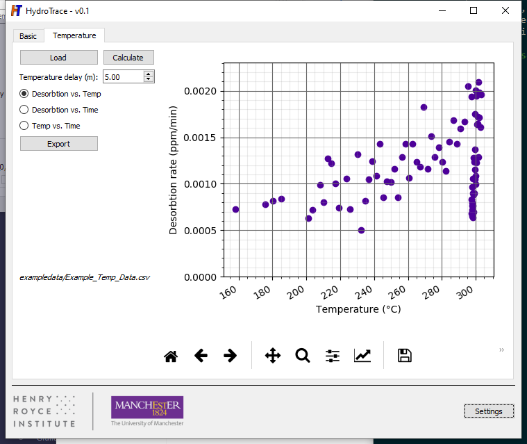
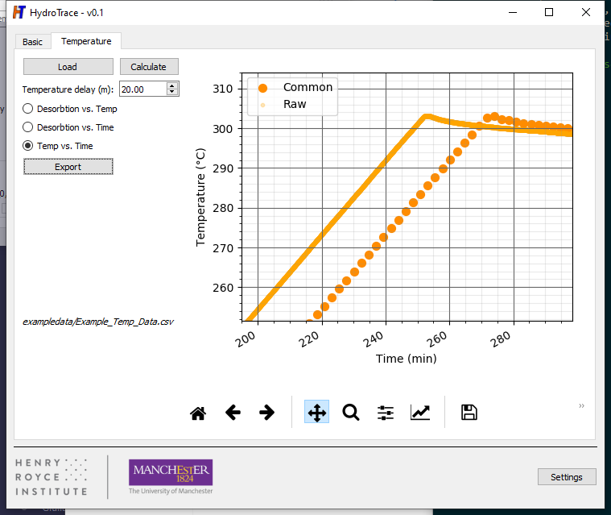

 

# Background
In order to address several shortcomings with ensuring similitude in examining the output from commercial hydrogen analysers, a modest suite of tools written with freely available Python 3 libraries has been developed to perform basic analyses. This consists of several high-level functions that can be accessed directly from interactive Python, as well as a Graphical User Interface (GUI) to use/demonstrate them.

Analysis requires two data files with the format exemplified, one stemming from a temperature data acquisition device and the second from a Chem Station-type gas chromotographer. HydroTrace has been specifically developed to merge these records along with other experimental settings to provide:

* Calculate the total hydrogen content;
* Provide desorbtion versus temperature records; and
* Enable extentions to batch processing of hydrogren desorbtion curves and modelling efforts.

# Installation
Using `pip`, either install directly from the `*.tar.gz` archive available in `/~dist`, or through PyPI:
The function can be called from interactive Python according to:
~~~
>pip install HydroTrace
~~~

# Graphical interface
Once installed, the graphical interface can be launched with:
~~~
>python -m HydroTrace.main
~~~

## Calculating total hydrogen content

Under the 'basic' tab of the user interface ([Fig. 1](#fig1)), parameters stemming from the run are entered along with the relevant chromatography record and the final content is calculated. Apparatus constants can be accessed/updated via the Settings button ([Fig. 2](#fig2)), which are resilient and are installation specific.

  
* Overview of the HydroTrace GUI*

  
* Configuration settings accessed by pressing 'Settings' on the main screen.*

## Generating desorbtion vs. temperature data
Once the relevant entries have been entered under the 'basic' tab, then temperature data can be loaded in the 'Temperature' tab ([Fig. 3](#fig3)). Desorbtion vs. time as well as the temperature timeseries can also be examined by selecting the appropriate radio button. 

  
* Desorbtion vs. temperature plot*

The temperature vs. time plot will show raw data from the datalogger and points interpolated for the GC timebase with the delay imposed. This delay is necessary to account for 'time of flight' of hydrogen from the location where the sample is being heated to arriving at the chromatographer.

  
* Temperature vs. time, showing the imposed delay between the GC and temperature data records.*

The merged records can be exported by clicking the `Export` button, whereby the data will be written in a comma separated format file, with a single header line describing the columns.

## Functions for command line processing
To access the underlying functions, import them from HydroTrace according to:
~~~
>>>from HydroTrace.hydro_trace_common import *
~~~
where * is one of the following:

Function | Description
---  |---
`read_cs_file(fname)` | *Parameters*: full path and file name to the Chem Station file formatted in the same way as provided in the exampledata. *Returns*: `int_run`: numpy array, `area`: numpy array, `dt` list of datetime objects. While `dt` is a datetime array of all injection times, `int_run` provides an index of these where there `area` could be measured. All are returned as `None` if unsuccessful.
`read_pico_csv(fname)` | *Parameters*: full path and file name to the temperature record formatted in the same way as provided in the exampledata. *Returns*: `temp`: numpy array, `dt`: list of datetime objects. `dt` is a datetime array of all temperature measurement points, `temp` is the temperature at these datetimes, both are returned as `None` if unsuccessful.
`interp_datetime(dt0,d0,dt1)` | *Parameters*: `dt0` and `d0` are incoming list of datetime objects and values, respectively. `dtl` is a list of datetimes within the range captured by `dt0`. *Returns*: `fdtl`: numpy array, `dtl_mdates`: numpy array. `fdtl` is interpolated values corresponding to input datetimes `dt1`, `dtl_mdates` is an array of matplotlib mdate values corresponding to `dtl` for plotting purposes.
`calc_total(hsc,std_pa,w,cgas,frate,ctime,area)` | *Parameters*: H std content in ppm (`hsc`), H std peak area (`std_pa`), weight in g (`w`), carrier gas µmol/s (`cgas`), flow rate in mL/min (`frate`), cycle time in min (`ctime`) - all float values and area (numpy array from `read_cs_file`). *Returns*: `content` as float.
`calc_desorbtion_rate(hsc,std_pa,w,cgas,frate,area)` | *Parameters*: H std content in ppm (`hsc`), H std peak area (`std_pa`), weight in g (`w`), carrier gas µmol/s (`cgas`), flow rate in mL/min (`frate`), - all float values and area (numpy array from `read_cs_file`). *Returns*: `rates` as numpy array.

# Further information

This application has been developed in support of activities conducted at the Royce Institute at the University of Manchester. Please see LICENSE for further details.